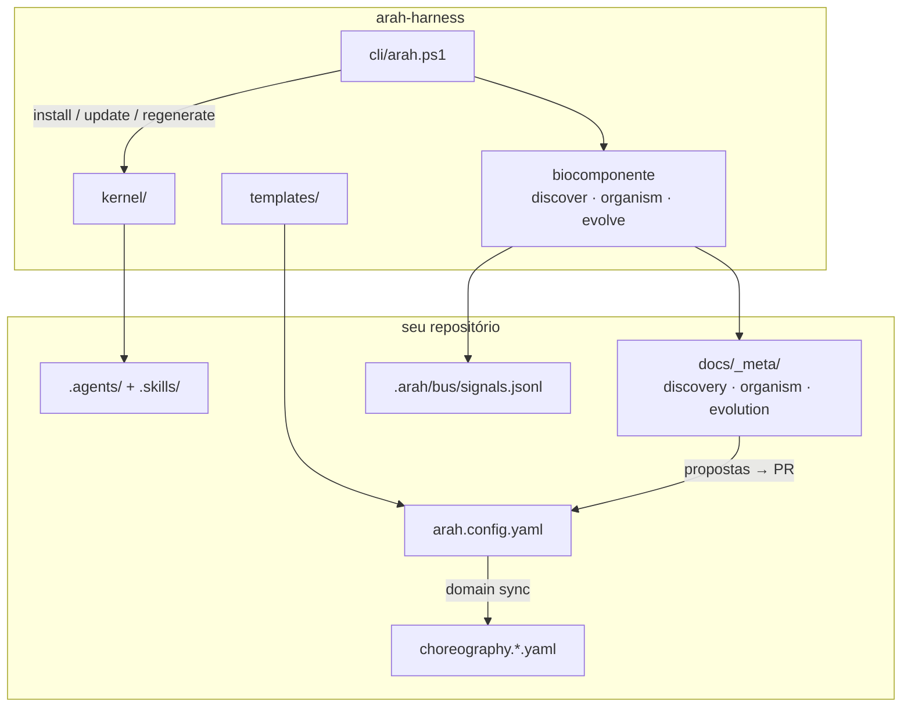

# ARAH Harness

[](https://github.com/sraphaz/arah-harness/actions/workflows/ci.yml)
[](LICENSE)
[](VERSION)
[](docs/specs/arah-biocomponent.spec.yaml)

**ARAH** — *Agent Runtime Autonomous Harness*

O kernel open-source que transforma qualquer repositório em um **organismo de agentes**: coreografado, auditável, observável — e, desde a v0.3, **autônomo o bastante para se descobrir, se organizar e evoluir**.

> Extraído do ecossistema [Arah](https://github.com/sraphaz/arah). Validado em produção e no monorepo legaltech **[IAutos](https://github.com/sraphaz/iautos)**.

---

## A ideia em uma frase

Instale o harness uma vez. Ele observa o domínio e a stack, propõe os agentes certos, define como eles se comunicam e melhora a cada ciclo — **sempre com você no comando do merge**.

```text
  humano define intenção
        │
        ▼
  ┌─────────────────────────────────────────┐
  │  ORGANISMO ARAH                         │
  │  discover → cells → signals → evolve    │
  │  coreografia · skills · gates · audit   │
  └─────────────────────────────────────────┘
        │
        ▼
  Pull Request → CI → ready-for-merge → merge humano
```

---

## Por que existe

Sem um harness, cada repositório novo replica à mão:

- Manifests de agentes e skills
- Coreografia path-based
- Scripts de orquestração e gates
- Hooks, rules, workflows CI
- Specs SDD, Definition of Done, Agent Graph

**ARAH versiona isso uma vez.** Seu produto recebe o kernel via `install` e customiza só o que é dele — `arah.config.yaml`, overlays e domínio.

---

## O que torna o ARAH diferente

| Capacidade | Spec Kit | BMAD | autonomous-sdlc | harnessforge | **ARAH** |
|---|:---:|:---:|:---:|:---:|:---:|
| CLI bootstrap | ✅ | ✅ | ✅ | ✅ | ✅ |
| Multi-agente SDLC | ❌ | ✅ | ✅ | ❌ | ✅ |
| Coreografia por paths | ❌ | ❌ | ❌ | ❌ | ✅ |
| Agentes de domínio consultivos | ❌ | ❌ | ❌ | ❌ | ✅ |
| Agent Graph auditável | ❌ | parcial | parcial | ❌ | ✅ |
| Drift-check (`sync-check`) | ❌ | ❌ | parcial | ✅ | ✅ |
| Comunicação passiva (tokens) | parcial | ❌ | parcial | ✅ | ✅ |
| **Biocomponente** (discover → evolve) | ❌ | parcial | parcial | ❌ | ✅ |

### Biocomponente — a dimensão viva

Desde a **v0.3**, o harness não é só um pacote de arquivos. É um **biocomponente tecnológico** instalado no repositório:

| Fase | Comando | O que acontece |
|------|---------|----------------|
| Percepção | `discover` | Lê stack, estrutura e pistas de domínio |
| Ontogenia | `organism bootstrap` | Define células, tecidos e vias de sinal |
| Comunicação | `organism signal` | Sinais tipados, append-only, auditáveis |
| Aprendizado | `evolve` | Propõe melhorias a partir do ledger |
| Homeostase | `regenerate` | Atualiza kernel + regenera o organismo |

**Princípio de ouro:** agentes *propõem*; humanos *aplicam*.  
Nada de spawn silencioso. Nada de merge automático. Evolução por seleção via PR.

→ Guia completo: **[docs/BIOCOMPONENT.md](docs/BIOCOMPONENT.md)**

---

## Começar em 60 segundos

```powershell
git clone https://github.com/sraphaz/arah-harness.git $env:USERPROFILE\arah-harness
cd C:\caminho\para\meu-projeto

powershell -ExecutionPolicy Bypass -File $env:USERPROFILE\arah-harness\cli\arah.ps1 install `
  -ProjectName "meu-projeto"

# Deixe o organismo se formar
powershell -File $env:USERPROFILE\arah-harness\cli\arah.ps1 regenerate -Target . -UpdateKernel
```

Revise as propostas em `docs/_meta/`, ajuste `arah.config.yaml`, abra o PR.

Guia detalhado: **[docs/INSTALL.md](docs/INSTALL.md)** · Checklist: **[docs/BOOTSTRAP.md](docs/BOOTSTRAP.md)**

---

## Arquitetura



### Camadas

| Camada | O quê | Quem mexe |
|--------|-------|-----------|
| Produto | Código da aplicação | Agentes operacionais + humanos |
| Domínio | Pareceres de negócio | Agentes consultivos (gerados) |
| Kernel | Operacionais, skills, scripts, hooks | `arah update` / `regenerate` |
| Config | `arah.config.yaml`, overlays, AGENTS.md | Humano (+ Apply revisável) |
| Organismo | Manifesto, sinais, evolução | Biocomponente + PR |

---

## CLI

### Essencial

| Comando | Função |
|---------|--------|
| `install` | Bootstrap completo (recomendado) |
| `init` | Kernel + templates + CI |
| `update [-Force]` | Reaplica kernel (preserva config) |
| `doctor` | Valida instalação |
| `sync-check` | Drift vs upstream (CI) |
| `domain sync` | Gera agentes de domínio |
| `export-graph` | Agent Graph (JSON + Mermaid) |

### Biocomponente

| Comando | Função |
|---------|--------|
| `discover [-Apply]` | Observa repo → propostas de domínio/stack |
| `organism bootstrap` | Ritual do primeiro momento |
| `organism status` | Estado do organismo |
| `organism signal` | Emite sinal tipado no bus |
| `evolve [-Apply]` | Ciclo de self-learning |
| `regenerate [-UpdateKernel]` | Homeostase completa no consumidor |

```powershell
# Atualizar um repo que já usa ARAH para v0.3
powershell -File cli/arah.ps1 regenerate -Target C:\meu-projeto -UpdateKernel -Force
```

---

## Estrutura do repositório

```
arah-harness/
├── kernel/                 # Superfície distribuída (versionada)
│   ├── .agents/            # Operacionais + domain advisors + coreografia
│   ├── .skills/            # Procedimentos determinísticos
│   ├── .cursor/            # Hooks (domain review + live session)
│   └── scripts/            # Orquestração, gates, biocomponente, telemetria
├── cli/                    # install · discover · organism · evolve · regenerate
├── extension/arah-live/    # Painel Cursor/VS Code em tempo real
├── harness/profiles/       # Tiers: minimal → enterprise
├── schemas/arah-harness/   # Contratos canônicos
├── templates/              # Config, AGENTS.md, CI
├── docs/                   # Método, biocomponente, governança
└── scripts/self-test.ps1
```

---

## Princípios

1. **Humano comanda** — merge sempre humano  
2. **Tudo via Pull Request**  
3. **Escopo mínimo** por manifest  
4. **Spec-before-code** quando a fase exige  
5. **Contexto sob demanda** — arquivo + CI + sinais tipados (sem chat obrigatório)  
6. **Agentes propõem; humanos aplicam** — autonomia com ledger  
7. **Kernel imutável no consumidor** — customização em config e overlays  

---

## Documentação

| Documento | Conteúdo |
|-----------|----------|
| **[BIOCOMPONENT.md](docs/BIOCOMPONENT.md)** | Dimensão viva — discovery, organismo, sinais, evolução |
| [METHOD.md](docs/METHOD.md) | Método ARAH completo |
| [INSTALL.md](docs/INSTALL.md) | Instalar em qualquer repo |
| [BOOTSTRAP.md](docs/BOOTSTRAP.md) | Checklist pós-install |
| [GOVERNANCE.md](docs/GOVERNANCE.md) | Autonomia e gates humanos |
| [MODEL.md](docs/MODEL.md) | Harness-model first-class |
| [LIVE_SESSION.md](docs/LIVE_SESSION.md) | Telemetria + extensão |
| [MARKET_REFERENCE.md](docs/MARKET_REFERENCE.md) | Posicionamento vs mercado |
| [CHANGELOG.md](CHANGELOG.md) | Histórico de versões |

---

## Exemplo real

**[IAutos](https://github.com/sraphaz/iautos)** — monorepo legaltech white-label:

- Domínios consultivos (`core-cases`, `compliance`, `auth-tenant`, …)
- Overlay `choreography.iautos.yaml` para monorepo
- Separação clara: SDLC ARAH no repo vs agentes runtime do produto

---

## Desenvolvimento deste repo

```powershell
./scripts/self-test.ps1
```

Contribuindo: [CONTRIBUTING.md](CONTRIBUTING.md)

---

## Licença

[MIT](LICENSE) — Copyright (c) 2026 Raphael / Arah contributors
