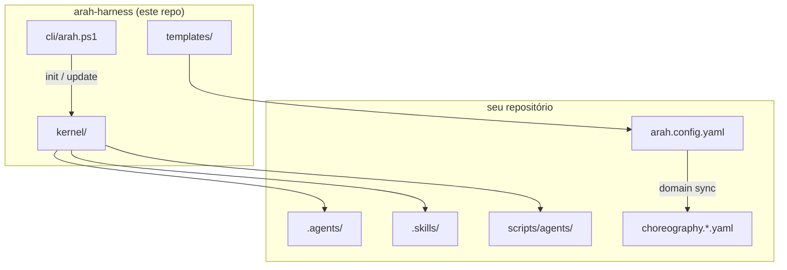

# ARAH Harness

[](https://github.com/sraphaz/arah-harness/actions/workflows/ci.yml)
[](LICENSE)
[](VERSION)

**ARAH** — *Agent Runtime Autonomous Harness*

Kernel open-source para bootstrap de repositórios **gerenciados por agentes**: multi-agente coreografado, auditável, observável, com economia de tokens — sem copiar `.agents/`, scripts e gates em cada projeto novo.

> Extraído e generalizado do ecossistema [Arah](https://github.com/sraphaz/arah). Validado em produção interna e no monorepo **IAutos** (legaltech).

---

## Por que existe

Cada repo novo exigia replicar manualmente:

- Manifests YAML (`.agents/`, `.skills/`)
- Coreografia path-based (`choreography.yaml`)
- Scripts PowerShell (`scripts/agents/`, `scripts/harness/`)
- Hooks Cursor, rules escopadas, workflows CI
- Specs SDD, gates, Definition of Done, Agent Graph

**ARAH Harness** versiona isso uma vez. Seu produto recebe via `init` + `arah.config.yaml`.

## Diferencial vs mercado

| Capacidade | Spec Kit | BMAD | autonomous-sdlc | harnessforge | **ARAH** |
|---|:---:|:---:|:---:|:---:|:---:|
| CLI bootstrap | ✅ | ✅ | ✅ | ✅ | ✅ |
| Multi-agente SDLC | ❌ | ✅ | ✅ | ❌ | ✅ |
| Coreografia por paths | ❌ | ❌ | ❌ | ❌ | ✅ |
| Agentes de domínio consultivos | ❌ | ❌ | ❌ | ❌ | ✅ |
| Agent Graph auditável | ❌ | parcial | parcial | ❌ | ✅ |
| Drift-check (`sync-check`) | ❌ | ❌ | parcial | ✅ | ✅ |
| Comunicação passiva (tokens) | parcial | ❌ | parcial | ✅ | ✅ |

## Arquitetura



## Instalar em outro repositório

```powershell
# Clone (uma vez)
git clone https://github.com/sraphaz/arah-harness.git $env:USERPROFILE\arah-harness

# No repo-alvo
cd C:\caminho\para\meu-projeto
powershell -ExecutionPolicy Bypass -File $env:USERPROFILE\arah-harness\cli\arah.ps1 install -ProjectName "meu-projeto"
```

Guia completo: **[docs/INSTALL.md](docs/INSTALL.md)**

Após editar `arah.config.yaml` (testes + domínios):

```powershell
$HARNESS = if ($env:ARAH_HARNESS_PATH) { $env:ARAH_HARNESS_PATH } else { "$env:USERPROFILE\arah-harness" }
powershell -File $HARNESS\cli\arah.ps1 domain sync
powershell -File .\scripts\agents\validate-manifests.ps1
powershell -File $HARNESS\cli\arah.ps1 export-graph
powershell -File $HARNESS\cli\arah.ps1 doctor
```

## CLI

| Comando | Descrição |
|---------|-----------|
| `install` | `init` + `doctor` + próximos passos (recomendado) |
| `init` | Instala kernel + templates + workflow CI |
| `domain sync` | Gera agentes de domínio + `choreography.domains.yaml` |
| `validate-runtime` | Valida coreografia de agentes runtime (`runtime:` em `arah.config.yaml`) |
| `export-graph` | Gera `docs/_meta/agent-graph.generated.json` |
| `export-graph` | Exporta Agent Graph (JSON + Mermaid) |
| `update [-Force]` | Reaplica kernel (preserva config/overlays) |
| `sync-check` | Detecta drift vs kernel (ideal no CI) |
| `doctor` | Valida instalação |

## Estrutura

```
arah-harness/
├── kernel/              # Copiado para projetos-alvo (versionado)
│   ├── .agents/         # 11 operacionais + schema agent-graph
│   ├── .skills/         # 18 skills executáveis
│   ├── .cursor/         # hooks passivos
│   └── scripts/         # orquestração, gates, export graph
├── cli/                 # init | update | doctor | domain sync | …
├── templates/           # arah.config.yaml, AGENTS.md, CI
├── docs/                # METHOD, mercado, bootstrap, migração
└── scripts/self-test.ps1
```

## Princípios

1. **Humano comanda, agente executa** — merge sempre humano
2. **Tudo via Pull Request**
3. **Escopo mínimo** por manifest
4. **Spec-before-code** quando aplicável
5. **Contexto sob demanda** — pareceres passivos (arquivo + CI), sem turnos extras
6. **Kernel imutável** — customização em `arah.config.yaml` e overlays `choreography.*.yaml`

## Documentação

| Doc | Conteúdo |
|-----|----------|
| [docs/METHOD.md](docs/METHOD.md) | Método ARAH completo |
| [docs/MARKET_REFERENCE.md](docs/MARKET_REFERENCE.md) | Referências e decisões |
| [docs/INSTALL.md](docs/INSTALL.md) | Instalar em qualquer repo |
| [docs/BOOTSTRAP.md](docs/BOOTSTRAP.md) | Checklist pós-init |
| [docs/MIGRATION_FROM_ARAH.md](docs/MIGRATION_FROM_ARAH.md) | Migrar repo Arah existente |
| [CONTRIBUTING.md](CONTRIBUTING.md) | Como contribuir |
| [CHANGELOG.md](CHANGELOG.md) | Histórico de versões |

## Exemplo real

**IAutos** ([sraphaz/iautos](https://github.com/sraphaz/iautos)) — monorepo legaltech white-label:

- 6 domínios consultivos (`core-cases`, `compliance`, `auth-tenant`, …)
- Overlay `choreography.iautos.yaml` para `packages/**` e `apps/web/**`
- Separação clara: ARAH SDLC (repo) vs agentes runtime (`packages/ai-orchestrator/agents/`)

## Desenvolvimento deste repo

```powershell
./scripts/self-test.ps1
```

## Licença

[MIT](LICENSE) — Copyright (c) 2026 Raphael / Arah contributors
