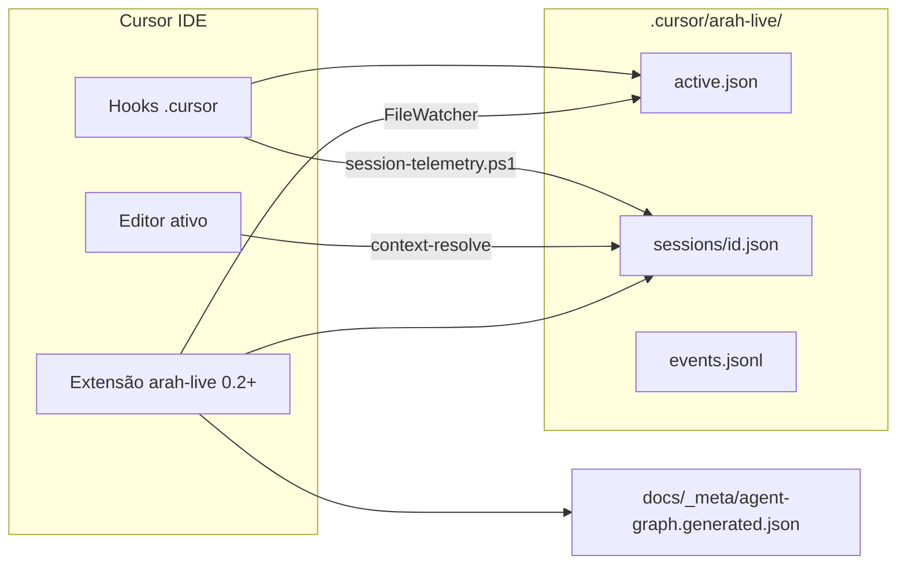

# ARAH Live Session

Documentação da extensão e telemetria ao vivo (v2).

## Arquitetura



## Modelo v2 — sessão por conversa

| Arquivo | Função |
|---------|--------|
| `active.json` | Ponteiro para o chat/sessão ativo (`conversation_id`) |
| `sessions/{id}.json` | Estado isolado por conversa (regras, agentes, skills) |
| `events.jsonl` | Eventos de telemetria (append) |
| `diagnostics.jsonl` | Log de erros/avisos (extensão + telemetria) |

### Ver logs

- **Output Channel:** `Ctrl+Shift+P` → **ARAH: Abrir log de diagnóstico**
- **Arquivo:** `.cursor/arah-live/diagnostics.jsonl`
- **Eventos:** `.cursor/arah-live/events.jsonl`

### Fontes de contexto (`context_source`)

| Valor | Origem |
|-------|--------|
| `session-start` | Hook ao abrir chat do agente |
| `agent-edit` | Agente editou arquivo (Write/StrReplace) |
| `file-edit` | Hook afterFileEdit |
| `editor-focus` | Fallback: arquivo ativo no editor (extensão) |

### Multi-root

A extensão detecta todos os workspace folders com `arah.config.yaml`. O contexto primário segue o **arquivo ativo no editor**; se não houver, usa o primeiro repo ARAH.

### Troca de aba de chat

Três caminhos atualizam `active.json` para o chat em foco:

| Caminho | Quando |
|---------|--------|
| **Extensão 0.2.1+** | Poll do `lastFocusedComposerIds` no SQLite do Cursor (`state.vscdb`) |
| **`beforeSubmitPrompt`** | Ao enviar mensagem no chat |
| **`preToolUse`** | Início de cada turno de ferramenta do agente |

Ação `conversation-focus` em `session-telemetry.ps1` — só troca o ponteiro; não recalcula coreografia.

**Fallback editor:** `context-resolve` ao focar arquivo no editor.

## Instalar extensão

```powershell
cd extension/arah-live
npm install; npm run compile
# Copiar para %USERPROFILE%\.cursor\extensions\sraphaz.arah-live-0.2.0
```

## Demo local

```powershell
./scripts/agents/demo-live-session.ps1
./scripts/agents/demo-live-session.ps1 -SecondChat  # simula troca de conversa
```

## Limpar estado antigo

```powershell
Remove-Item -Recurse -Force .cursor/arah-live
./scripts/agents/demo-live-session.ps1
```

## Atualizar kernel em projeto existente

```powershell
powershell -File $HARNESS\cli\arah.ps1 update -Target C:\caminho\projeto -Force
```
